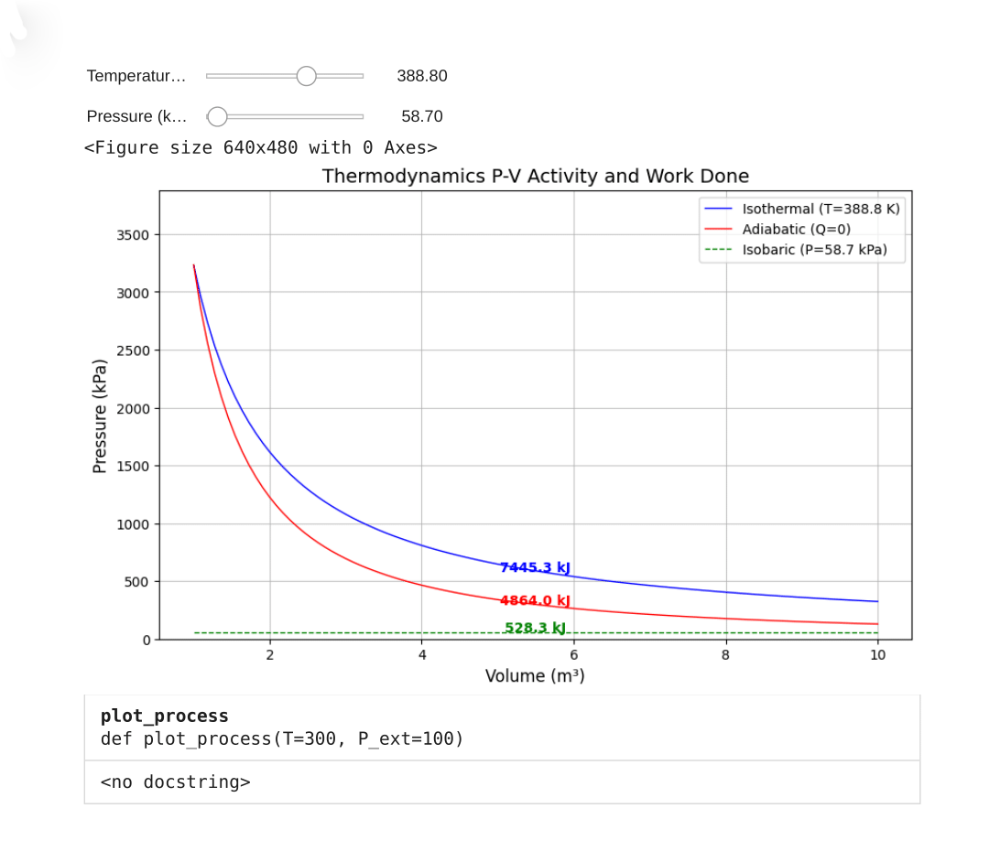

# Thermodynamic Analysis: P-V diagrams & Work

  

### Overview of Thermodynamic Processes

Thermodynamic processes describe how a system transitions from one state to another, often represented on Pressure-Volume (P-V) diagrams. These processes are governed by fundamental principles of thermodynamics and provide insights into energy transformations within a system.

The **isothermal process** occurs at constant temperature ($T = \text{constant}$), meaning that the system exchanges heat with its surroundings to maintain thermal equilibrium. This process is governed by Boyle's Law, which states that the product of pressure ($P$) and volume ($V$) remains constant: $P \cdot V = \text{constant}$. The work done during an isothermal expansion or compression is calculated using the formula:

### $W = nRT \ln\left(\frac{V_2}{V_1}\right),$

where:
- $n$ is the number of moles,
- $R$ is the universal gas constant,
- $T$ is the absolute temperature.

Since the temperature remains constant, the internal energy of the system does not change, and all the heat supplied is converted into work.

In contrast, the **adiabatic process** involves no heat exchange between the system and its surroundings ($Q = 0$). As a result, any work done by the system comes at the expense of its internal energy, leading to a change in temperature. The adiabatic process is governed by the equation $P \cdot V^\gamma = \text{constant}$, where $\gamma = C_p / C_v$ is the adiabatic index (ratio of specific heats). The work done during an adiabatic process is given by:

### $W = \frac{P_1V_1 - P_2V_2}{\gamma - 1}.$

Because there is no heat exchange, the adiabatic curve on a P-V diagram is steeper than the isothermal curve, reflecting the more rapid drop in pressure as the gas expands.

The **isobaric process** occurs at constant pressure ($P = \text{constant}$). In this case, the work done is simply the product of pressure and the change in volume:

### $W = P \cdot (V_2 - V_1).$

Since the pressure remains constant, the system can exchange heat with its surroundings, and the temperature may vary depending on the amount of heat added or removed.

### Why Adiabatic Curves Are Steeper

In an adiabatic process, the lack of heat exchange means that all work done comes from the internal energy of the gas. As the gas expands, its temperature decreases, leading to a steeper drop in pressure compared to an isothermal process where heat compensates for the energy loss.

